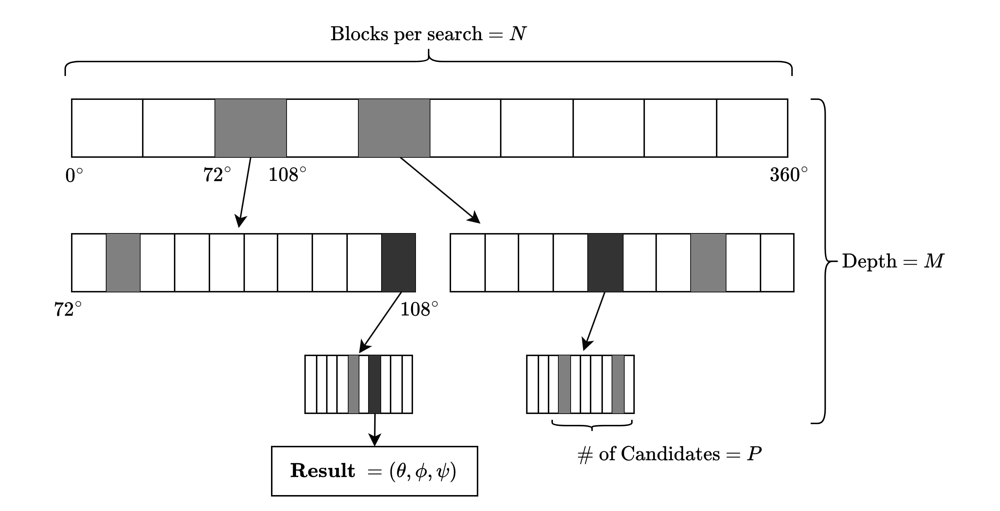
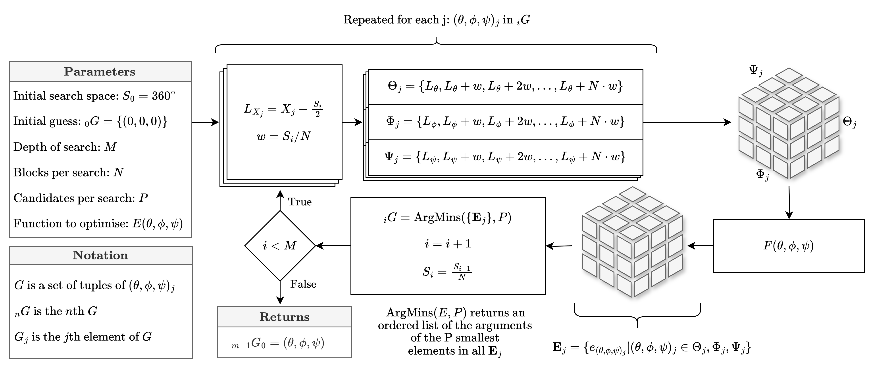

<head>
  <meta http-equiv="Content-Type" content="text/html; charset=utf-8" />
  <meta http-equiv="Content-Style-Type" content="text/css" />
  <meta name="generator" content="pandoc" />
  <meta name="author" content="Chayce Ross and Sarah Gauthier" />
  <title>Sigma</title>
  
  
  
</head>
<body>

<h1 class="title">Sigma</h1>
<h2 class="author">Chayce Ross and Sarah Gauthier</h2>
<h3 class="date">6th April 2024</h3>

<h1 class="unnumbered" id="introduction-and-theory">Introduction and
Theory</h1>

In order to map the coordinate system for the fiducials in the CT
scans \(x_l\) (“CT fiducials") to the
fiducials in our game world \(x_r\)
(“physical fiducials") we used Horns algorithm (Robotics Knowledgebase 11th May
2020). The goal of Horn’s algorithm is to minimize the error
(\(e_i\)) in distance between
corresponding fiducials in two coordinate systems.

<h1 class="unnumbered" id="steps">Steps</h1>
<ol>
<li>
Find the centroid of each coordinate system where each fiducial
has equal weighting. \[\begin{aligned}        \overline{x}  =
\frac{1}{N} \sum_i x_i     \end{aligned}\]
</li>
<li>
Create new coordinate systems \(x^{\prime}\) that are shifted by the
centroids. \[\begin{aligned}        x^{\prime}_i = x_i -
\overline{x}_i     \end{aligned}\]
</li>
<li>
Find the scale, by the ratio of the norm squared of each shifted
coordinate system. \[\begin{aligned}        s
= \sqrt{\left( \sum_{i} \vert x^{\prime}_{l,i} \vert ^{2}  \right)
\bigg/ \left( \sum_{i} \vert x^{\prime}_{r,i} \vert
^{2}  \right)}     \end{aligned}\]
</li>
<li>
Finally we find the rotation matrix, by minimizing the resulting
error function - \(F(\theta ,\phi,
\psi)\) (derivation can be found in Appendix 1). \[\begin{aligned}        R = \text{argmin} \,2
\left( \sqrt{\left( \sum_{i} \vert x^{\prime}_{l,i} \vert ^{2}  \right)
\left( \sum_{i} \vert x^{\prime}_{r,i} \vert ^{2}  \right)}  -
\sum_{i}  x^{\prime}_{l,i} \cdot \left( R x^{\prime}_{r,i} \right)
\right)     \end{aligned}\]
</li>
</ol>
<h2 class="unnumbered"
id="optimization-of-rotation-function">Optimization of Rotation
Function</h2>

The .NET standard library does not provide a package for scientific
analysis. While there are .NET packages that do provide ways of
optimizing functions, they have proven hard to include in our Unity
projects because many do not target Android. Accordingly, we implemented
our own optimizer \(Q\{E(\theta, \phi, \psi)\}
\to (\theta, \phi, \psi)\). Our algorithm uses a
<strong>prune and search</strong> method to iteratively
select candidate spaces. This drastically reduces the time complexity in
searching for the minimizing rotation matrix. If we were to test every
possible solution with an precision of \(\Delta t\) degrees of \((\theta , \phi , \psi )\) the search space
\(S\) would be \(S_\theta \cdot S_\phi \cdot S_\psi = \left(
\frac{S_0}{\Delta t} \right)^3\) where \(S_0\) is the breadth of the search
space.

<h3 class="unnumbered" id="prune-and-search">Prune and Search</h3>

Our prune and search algorithm breaks the search space (\(S_i\)) into an \(N \times N \times N\) tensor (\({}_i\mathbf{T}\)), where each element is
identified by its centre: \({}_i\mathbf{T}
_{(x,y,z)} = {}_i(\Theta_x, \Phi_y, \Psi_z)\) with \((x, y, z) \in [0, 1, \dots, N)\). We then
create a new tensor \(({}_i \mathbf{E}
)\), representing the corresponding errors by passing this tensor
through our error function: \({}_i \mathbf{E}
= F({}_i \mathbf{T} )\). The algorithm then selects the \(P\) smallest elements \(e_{0}, e_1, \dots, e_{P - 1}\) from \({}_i \mathbf{E}\), and returns their
corresponding arguments (“candidates”): \(G =
\{G_j | j \in [0, 1, \dots, P) \}\). These define \(P\) new search spaces each with size \(S_i / N\). Successive iterations of the
algorithm run similarly on each element \(G_j\) of \({}_i
G\); however, the smallest elements \(e_{0}, e_1, \dots, e_{P - 1}\) are selected
from all \(\mathbf{E}_j\). i.e. Each
iteration only produces \(P\)
candidates for the next iteration. This is repeated for \(M\) iterations, i.e. \(i \in [0, 1, \dots M)\), where the
algorithm’s precision is \(\Delta t =
\frac{S_0}{N^M}\). On the last iteration the the candidate that
returns the smallest error is returned as the solution to the
optimization.

<figure id="fig:optimizer_tree">

<figcaption>Tree diagram of rotation optimizer (analogy in 1 dimension).
Note that the grey blocks are the minima values of each
sequence.</figcaption>
</figure>

The time complexity of this algorithm is: \[\mathcal{O} (N^3 \cdot P \cdot M) = \mathcal{O}
\left( PN^3 \cdot \frac{ \log (S_0 /\Delta t)}{\log N}\right)\]
When we consider for \(S_0 = 360^{\circ},\,
\Delta t = 0.1,\, N \sim \mathcal{O} (10),\, P \sim 10\) the time
complexity is about \(\mathcal{O}
(10^5)\) rather than the naive solution which was about \(\mathcal{O} (10^9)\).

<figure id="fig:optimizer">

<figcaption>Flowchart of rotation optimizer.</figcaption>
</figure>

Robotics Knowledgebase. 11th May 2020. “Registration Techniques in
Robotics.” 11th May 2020. <a
href="https://roboticsknowledgebase.com/wiki/math/registration-techniques/">https://roboticsknowledgebase.com/wiki/math/registration-techniques/</a>.

</body>