<head>
  <meta http-equiv="Content-Type" content="text/html; charset=utf-8" />
  <meta http-equiv="Content-Style-Type" content="text/css" />
  <meta name="generator" content="pandoc" />
  <meta name="author" content="Sarah Gauthier, Chayce Ross, Henrique Saito, Sumin Olivia Kim" />
  <title>Augmented Reality Guidance for CT Spinal Injections</title>
  
  
  
</head>
<body>

<h1 class="title">Augmented Reality Guidance for CT Spinal
Injections</h1>
<h2 class="author">Sarah Gauthier, Chayce Ross, Henrique Saito, Sumin
Olivia Kim</h2>
<h3 class="date">12th April 2024</h3>

<figure id="fig:controller_header">

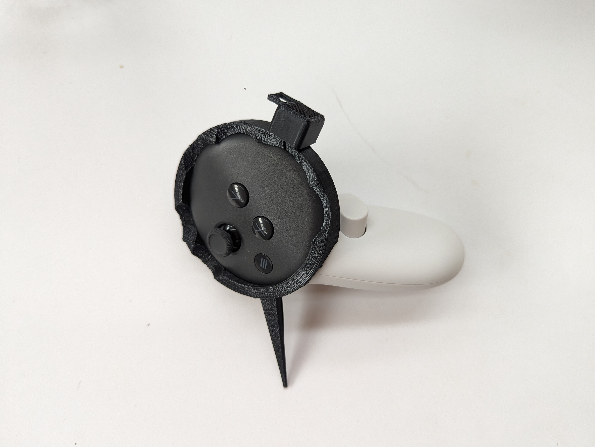 

</figure>

<h2 class="unnumbered" id="project-sponsor">Project Sponsor</h2>

Philip Edgcumbe - UBC Radiology 

<h2 class="unnumbered" id="project-2405">Project 2405</h2>

ENPH 459 
Engineering Physics Project Lab 
University of British Columbia 

<h1 id="introduction---olivia">Introduction - Olivia</h1>
<h2 id="background">Background</h2>

Spinal injections are a common medical procedure involving the
injection of medication near specific nerves in the spinal area to
relieve pain. These procedures are performed by neuroradiologists who
use CT scans of the patient’s spine to guide the injection needle to the
desired location. To ensure precise needle placement, physicians must
take multiple CT scans of the patient’s spine at different angles to
confirm that the needle is correctly inserted. This is a long process
that exposes patients and physicians to harmful radiation. Additionally,
due to the trial-and-error nature of this procedure, it may require
multiple needle insertion attempts, each involving a series of CT
scans. 
To reduce the number of CT scans and needle insertion attempts required,
we propose an Augmented Reality (AR) tool, using the Meta Quest 3
headset, to guide these spinal injection procedures.

<h2 id="team-introduction---sponsors-and-students">Team Introduction -
Sponsors and Students</h2>

This project is sponsored by Dr. Philip Edgcumbe, a resident
physician, entrepreneur, biomedical engineer and clinician-scientist
(MD, PhD) working in Diagnostic Radiology at the University of British
Columbia (UBC). Dr. Edgcumbe also holds a BASc in Engineering Physics
from UBC, obtained in 2011. He has invented, patented and licensed an
augmented reality navigational aid for surgery and co-founded two
biomedical start-up companies. Given his extensive background in both
medicine and engineering, Dr. Philip Edgcumbe was able to provide
excellent guidance and support throughout this project. 
In addition to Dr. Edgcumbe, Dr. Will Guest (MD, PhD, BSc), a
neuroradiologist at the Vancouver General Hospital (VGH), provided
supervisory support. 
The student team is comprised of four 4th-Year Engineering Physics
students at UBC: Sarah Gauthier, Chayce Ross, Henrique Saito and Sumin
Olivia Kim.

<h2 id="discussion-with-stakeholders">Discussion with Stakeholders</h2>

Prior to developing this AR solution, the team held discussions with
stakeholders to accurately scope project needs. Dr. Will Guest, a staff
physician at the Vancouver General Hospital was a key stakeholder in
this project, with in-depth experience with spinal injections and
radiology. 
During an interview conducted at the Vancouver General Hospital, Dr.
Guest described in detail the steps involved in a spinal injection
(which we outline in <a
href="#spine-procedure:Overview of Spinal Injection Procedure"
data-reference-type="ref"
data-reference="spine-procedure:Overview of Spinal Injection Procedure">1.4</a>).
He also explained the limitations of the current procedure. He mentioned
that the procedure can be uncomfortable to perform for physicians as the
patient needs to be lying inside the CT scanning unit at all times. If a
patient has a large torso, they may take up most of this area, making it
difficult to insert the needle at the right angle. 
Dr. Guest expressed that having the patient’s bony structures projected
onto their body during this procedure would be a great asset to
neuroradiologists as they would be able to insert the needle using with
less iterative CT scans, and perform the injections more quickly.

This interview allowed the engineering team to assess the key project
objectives. 
<a href="https://www.youtube.com/watch?v=NSqduAn1Zb4">This video shows
the steps of a CT-guided spinal procedure, by Dr. Will Guest.</a>

<h2 id="spine-procedure:Overview of Spinal Injection Procedure">Overview
of Spinal Injection Procedure</h2>

Spinal injection procedures are used primarily to relieve pain by
delivering medication directly to the spinal nerves’ vicinity, and are
often employed in cases of chronic back pain, sciatica, herniated discs,
and spinal stenosis, among other conditions. 
 
The procedure involves patient preparation, precise needle insertion
guided by imaging techniques (such as fluoroscopy or CT scans), and
medication delivery directly to the pain site. 

<ol>
<li>
<strong>Patient Preparation:</strong> Before the procedure,
patients receive a comprehensive evaluation where the risks and benefits
are explained. This phase also involves monitoring vital signs and
positioning the patient.
</li>
<li>
<strong>Initial CT Scan:</strong> A CT scan of the patient’s
spinal region is done to accurately locate the optimal needle insertion
trajectory. This imaging m odality provides real-time visuals of the
spine, enabling precise needle guidance to the affected area.
</li>
<li>
<strong>Sterilization and Anesthesia:</strong> The skin over the
targeted site is meticulously cleaned and sterilized to minimize
infection risks. A local anaesthetic is then administered to numb the
area, reducing discomfort during needle insertion.
</li>
<li>
<strong>Initial Needle Insertion:</strong> With the patient still
inside the CT scanning unit, a needle is inserted through the skin,
about 1cm deep, and meticulously directed toward the area adjacent to
the spinal nerves.
</li>
<li>
<strong>Verification CT Scan:</strong> The physician takes
another CT scan of the patient with the needle inserted. The needle’s
position is checked. If the needle is in the right position, the
physician moves on to the next step. Otherwise, they remove the needle
and return to the initial needle insertion step.
</li>
<li>
<strong>Deeper Needle Insertion:</strong> The physician pushes
the needle in slightly deeper. The needle’s placement is continuously
adjusted based on imaging feedback until the optimal position is
confirmed. Subsequently, the medication—commonly a steroid or
anesthetic—is injected to diminish inflammation and mitigate
pain.
</li>
<li>
<strong>Procedure Conclusion:</strong> Upon successful medication
delivery, the needle is carefully withdrawn, and the injection site is
cleaned and bandaged. Post-injection, patients are observed for a brief
period to monitor for adverse reactions.
</li>
</ol>
<h2 id="previous-work---chayce">Previous Work - Chayce</h2>

This work is inspired by a previous paper ((Heinrich et al. 2019)) that tested
and compared different assistance and guidance techniques for needle
insertion procedures using the <a
href="https://www.microsoft.com/en-ca/hololens">Microsoft Hololens</a>,
an AR headset. In this paper, the researchers used the HoloLens to
project a needle trajectory above a foam block. The user would try to
match the trajectory and insert a needle into the foam. The goals of the
paper were to:

<ol>
<li>
Find out if AR headsets are a viable form of guidance for
surgical settings.
</li>
<li>
Compare the effectiveness of different visualization methods for
guidance, including the intersection of two planes, a line, and a cone
(Figure <a href="#fig:cones" data-reference-type="ref"
data-reference="fig:cones">2</a>).
</li>
</ol>
<figure id="fig:cones">
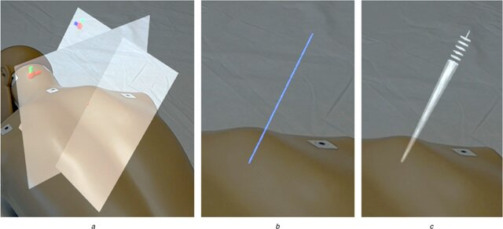
<figcaption>Different guidance methods for injections compared in the
HoloInjections paper ((Heinrich et al. 2019)).
<strong>(a)</strong> Intersection of planes, <strong>(b)</strong> line,
<strong>(c)</strong> cone.</figcaption>
</figure>
<h4 id="methodologyevaluation">Methodology/Evaluation</h4>

To test these different guidance cues, the authors of this paper
chose a trajectory angle at random and asked the user to follow it.
After the user inserted the needle completely into the block, they
measured the difference between the expected endpoint and the actual
endpoint of the needle. The authors evaluated each injection by two
criteria:

<ol>
<li>
<strong>In-Plane Accuracy:</strong> Remembering that each
injection is conducted in the <strong>transverse plane</strong> of the
patient, this measures the difference in angle between the expected and
actual angles in the transverse plane.
</li>
<li>
<strong>Out-of-Plane Accuracy:</strong> This measures the
smallest angle between the transverse plane of the patient and the angle
of the needle.
</li>
</ol>

After testing, the authors found that the <strong>cone</strong> was
the most accurate and intuitive method for guidance. They also concluded
that the HoloLens was not accurate enough to use for AR guidance and
some improvements would need to be made to the tracking sensors in the
headset. Moreover, the Hololens uses a “projection" technique to create
AR environments. To do this, it projects items onto a glass screen in
front of the user’s eyes. This allows for clear vision into the real
world but does not allow the 3D objects to be “embedded” into the user’s
environment. Rather, to the user, everything appears behind the
projections. This makes it hard to sense depth as the user cannot tell
when they have passed the intended point of insertion between the
projection and the real world. 
Given these important conclusions and our own research, we have chosen
to pursue the Meta Quest 3 headset given that it has greater depth
perception to allow the user to interact with the projections more
naturally.

<h2 id="problem-statement">Problem Statement</h2>

Spinal injection procedures currently rely on multiple CT scans to
guide needle placement. This traditional method exposes patients and
healthcare providers to significant radiation and often requires
numerous needle adjustments, making the process time-consuming and prone
to errors. There is a critical need for a solution that enhances
precision, reduces radiation exposure, and streamlines the procedure to
improve patient outcomes and safety.

<h2 id="sec:ProposedSolution">Proposed Solution</h2>

Our proposed solution leverages augmented reality (AR) technology to
enhance the accuracy, safety, and speed of spinal injection procedures.
By using an AR headset, we can provide the user with a real-time,
three-dimensional visual guidance system, embedded directly into the
operating environment. 
 
The core of our solution involves overlaying a virtual image of the
patient’s anatomical structures onto their actual body as viewed through
the AR headset. This “X-ray vision" feature allows the physician to see
the target area for the needle insertion without the need for repeated
CT scans, reducing radiation exposure for both patient and healthcare
providers. 
 
Additionally, our AR system projects the optimal needle trajectory into
3D space. This pathway guides the physician in real-time, suggesting the
best angle and depth for needle insertion.

<h2 id="project-objectives">Project Objectives</h2>

The project aims to develop a user-friendly augmented reality
solution to expedite spinal injection procedures. The AR solution should
achieve the following, in order of importance:

<ol>
<li>
Reduce the total operative time of the spinal injection
procedure
</li>
<li>
Reduce the average number of CT scans performed on the patient,
thereby reducing their exposure to radiation
</li>
<li>
Reduce the average number of needle insertion attempts required
per procedure
</li>
<li>
Reduce patient discomfort during the procedure
</li>
</ol>
<h1 id="discussion">Discussion</h1>
<h2 id="theory">Theory</h2>
<h3 id="computerized-tomography-ct-scans---sarah">Computerized
Tomography (CT) Scans - Sarah</h3>

To perform spinal injections, physicians must find the ideal
injection trajectory; one that avoids bony structures while targeting
the desired nerves. This is done using computerized tomography (CT)
scans of the patient’s spine. A CT scan is a diagnostic tool that uses
X-ray beams to produce images of a patient’s anatomical structures (John
Hopkins (Medicine
2023)). X-rays are beams of high-energy electromagnetic radiation
that are “absorbed in different amounts depending on the density of the
material they pass through" (Mayo (Clinic 2022)). The denser the material
is, the lighter it will appear in the X-ray or CT scan image. Thus,
bones and metals are easily identifiable on these types of scans since
they appear white. 
We can therefore leverage the fact that metal is easily identifiable in
CT scans to link the structures of the CT scans to the patient’s body in
the real world. We will explain this process in greater depth in Section
<a href="#reg:Registration" data-reference-type="ref"
data-reference="reg:Registration">2.1.4</a>. 

<figure id="fig:x_ray">

<figcaption>X-Ray image of a spine</figcaption>
</figure>

To produce CT scans, a patient is placed inside a CT scanning unit,
which is a large cylindrical tube. They are then slowly pushed through
this tube while an X-ray beam is aimed at the patient and quickly
rotated around their body (Figure <a href="#fig:ct_unit"
data-reference-type="ref" data-reference="fig:ct_unit">4</a>). 

<figure id="fig:ct_unit">
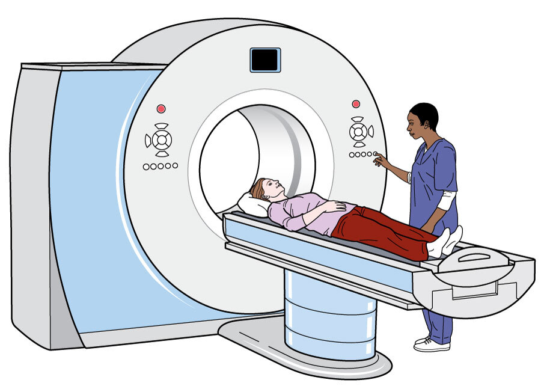
<figcaption>Animation of a patient inside a CT scanning
unit</figcaption>
</figure>

This produces a series of cross-sectional images, or "slices" of the
patient’s body (Figure <a href="#fig:ct_stack" data-reference-type="ref"
data-reference="fig:ct_stack">5</a>). These images can then be stacked
and rendered to form a three-dimensional object of the patient’s
anatomy.

<figure id="fig:ct_stack">
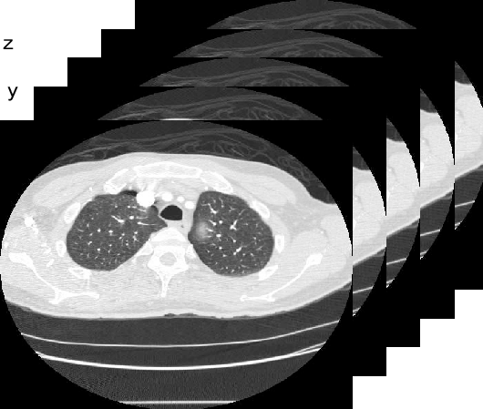
<figcaption>A stack of 2D cross-sectional CT scans</figcaption>
</figure>
<h3 id="augmented-reality---henrique">Augmented Reality - Henrique</h3>

Augmented Reality (AR) is a type of immersive technology that allows
the user to see both the virtual rendered world and the real physical
world around them. It provides the user with “visual elements, sound and
other sensory information [...] through a device like a smartphone,
glasses or a headset" ((Gillis
2024)). We can leverage this technology to give doctors all the
necessary information they need for the procedure while simultaneously
allowing them to keep eyes on the operation. In other words, this allows
us to give guidance without interfering with the doctor’s focus or
workflow. 
There are various head-mounted displays (HMD) (i.e. headsets) that
support augmented reality, with varying quality. Important factors to
consider include spatial mapping precision and pass-through
resolution.

<h3 id="unity">Unity</h3>

In this project, Unity serves as the core development environment for
creating AR applications designed to run on headsets. 
Unity’s platform allows developers to utilize features such as
controller tracking, spatial anchoring, and interactive visual overlays
to create immersive AR experiences that are stable and responsive. It
also allows developers to download software development kits (SDKs) for
different headset types to the platform, which greatly helps the
development process. After development, the Unity application can be
loaded onto the headset and tested.

<h3 id="reg:Registration">Registration</h3>

In order to map the coordinate system for the fiducials in the CT
scans \(x_c\) (“CT fiducials") to the
fiducials in our game world \(x_p\)
(“physical fiducials"). Where each fiducial \(x_{ci}\) is transformed by \(\underbar{x}_i = \underbar{t} + s \cdot \textbf{R}
\underbar{x}_{ci}\). Where \(\underbar{t}\) is a translation vector,
\(s\) is a scalar scaling factor and
\(\textbf{R}\) is a rotation matrix.
This process of mapping the two virtual coordinate systems together is
called “Registration”.

<h2 id="design-approach">Design &amp; Approach</h2>
<h3 id="proposed-user-experience-and-workflow">Proposed User Experience
and Workflow</h3>

To achieve our project objectives, we propose a system that allows
neuroradiologists to visualize both the patient’s internal anatomy and
the optimal needle insertion trajectory during spinal injections. 
When utilizing our developed AR solution, the physician would perform
spinal injections following these steps (illustrated in Figure <a
href="#fig:work-flow" data-reference-type="ref"
data-reference="fig:work-flow">6</a>):

<ol>
<li>
The physician places metal fiducial markers on the patient’s back
near the injection site.
</li>
<li>
The physician performs a CT scan of the patient’s torso with the
fiducial markers present.
</li>
<li>
The physician puts on the Quest 3 headset. The CT scan data is
loaded into the headset and is projected in front of the user.
</li>
<li>
The physician scrolls through all the CT slices using a scroll
bar below the images. When they see a white dot at the top of the CT
scan, they click on it to register it as a CT fiducial marker. When all
the fiducials are identified, the physician selects a desired CT slice
to annotate with the optimal needle trajectory.
</li>
<li>
The physician opens the CT scan annotation applet in the headset.
They select two points on the CT slice using the controller. A red line
joining these two points is created on the CT slice.
</li>
<li>
The stack of 2D CT slices is <strong>rendered into a 3D
object</strong> (<a href="#mesh:3D Meshing with Marching Cubes"
data-reference-type="ref"
data-reference="mesh:3D Meshing with Marching Cubes">2.2.4</a>)
representing the patient’s spine. The annotation of the needle
trajectory is rendered on the object.
</li>
<li>
The physician takes the controller with the pointer tip
attachment and opens the fiducial registration applet in the headset.
They tap each fiducial marker one at a time to <strong>register their
coordinates as spatial anchors</strong> (<a href="#spa:Spatial Anchors"
data-reference-type="ref"
data-reference="spa:Spatial Anchors">2.2.3</a>).
</li>
<li>
The fiducial markers on the 3D spinal object are <strong>mapped
to the fiducial markers on the patient’s torso using a coordinate
transformation</strong> (<a
href="#coord:Coordinate Transform using Horn&#39;s Method"
data-reference-type="ref"
data-reference="coord:Coordinate Transform using Horn&#39;s Method">2.2.5</a>).
The physician sees the needle trajectory and the patient’s internal
anatomy projected on their body.
</li>
<li>
The physician attaches the needle to one of the controllers using
a custom attachment piece. The controller allows the <strong>needle’s
location to be continuously tracked</strong> (<a
href="#cont:Controller Tracking and Attachments"
data-reference-type="ref"
data-reference="cont:Controller Tracking and Attachments">2.2.2</a>).
Wearing the headset, the physician follows the projected trajectory with
the needle attached to the controller.
</li>
<li>
The physician receives feedback on their alignment with the
optimal trajectory.
</li>
</ol>

The above components that are <strong>bolded</strong> have been
developed by our team. In the following sections, we provide an overview
of the critical design decisions made when developing these
components.

<figure id="fig:work-flow">
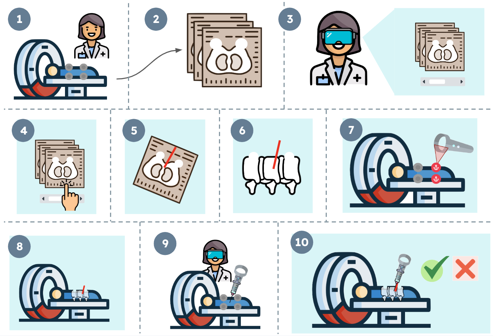
<figcaption>Proposed user experience using AR</figcaption>
</figure>
<h3 id="cont:Controller Tracking and Attachments">Controller Tracking
and Attachments</h3>

For both tracking the needle and registering fiducials, we must have
a method of knowing the exact coordinates of real-world tools in the
headset’s frame of reference. We can do this by using the two
controllers that come with the Quest 3 headset. These controllers are
automatically being tracked by the headset using IR beacons, and so we
can attach the needle or a pointer to the controller and by proxy know
its coordinates.

In software, each controller has a set of cartesian coordinates with
respect to the world. These coordinates represent the location of a
specific point on the controller. We can call this point the “tracking
anchor". Unfortunately, the tracking anchor of the Quest 3 controller is
at a seemingly arbitrary location on the face of the controller (Figure
<a href="#fig:controller_anchor" data-reference-type="ref"
data-reference="fig:controller_anchor">7</a>).

<figure id="fig:controller_anchor">
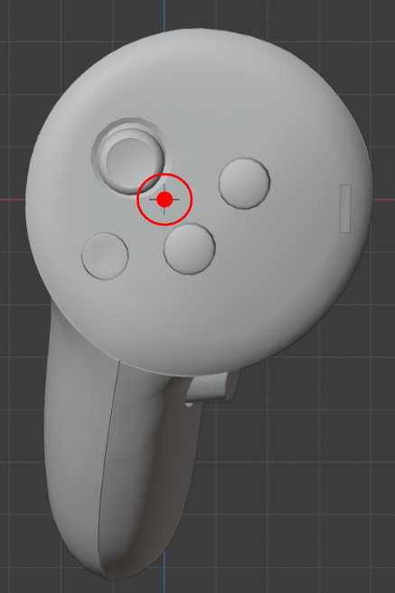
<figcaption>Quest 3 controller tracking anchor point</figcaption>
</figure>

Thus, the core technical problem is to find the offset between the
controller’s tracking anchor and the desired point that needs to be
tracked (needle or pointer end). In other words, we must find the black
vector illustrated in Figure <a href="#fig:controller_pointer_diagram"
data-reference-type="ref"
data-reference="fig:controller_pointer_diagram">8</a>, which shows an
example pointer attachment.

<figure id="fig:controller_pointer_diagram">
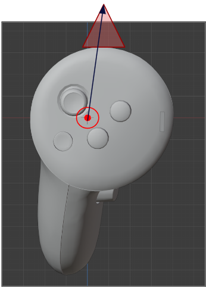
<figcaption>Unknown vector between anchor point and pointer
tip</figcaption>
</figure>

Our initial plan was to lock down the end of the pointer in one spot
with a purpose-built rig (as an example, see Figure <a
href="#fig:controller_calibration_rig" data-reference-type="ref"
data-reference="fig:controller_calibration_rig">9</a>). We then rotate
the controller around and record the Cartesian coordinates and rotation
of the controller at three different spots. We can convert the rotation
to a directional vector, which combines with the Cartesian coordinates
to form a line equation. By finding the intersection of these lines, we
can then find the desired point and thus the unknown vector.

<figure id="fig:controller_calibration_rig">
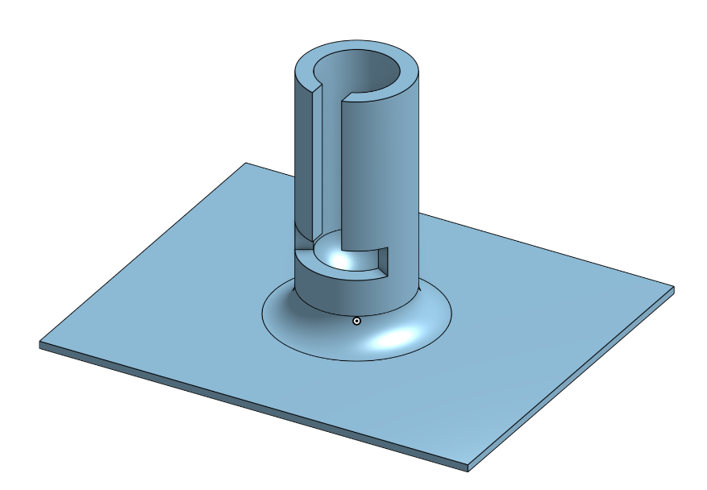
<figcaption>Example calibration rig to keep end point
static</figcaption>
</figure>

If the three lines were guaranteed to intersect, finding the
intersection would be trivial. Unfortunately, the lines will note
exactly intersect, so a least-squares approximation has to be used to
find the point which minimizes the distance to each of the lines. A
system diagram can be found in figures <a
href="#fig:old_calibration_diagram" data-reference-type="ref"
data-reference="fig:old_calibration_diagram">10</a> and <a
href="#fig:old_calibration_diagram2" data-reference-type="ref"
data-reference="fig:old_calibration_diagram2">11</a>.

<figure id="fig:old_calibration_diagram">
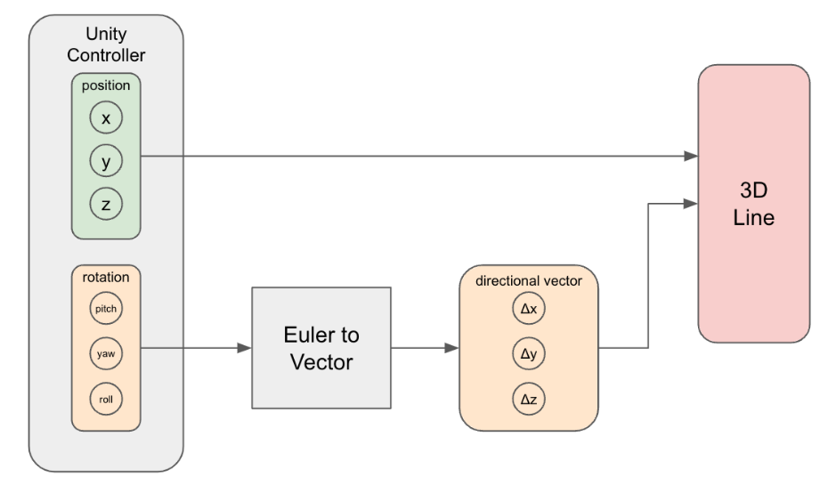
<figcaption>System diagram for each recorded controller
location</figcaption>
</figure>
<figure id="fig:old_calibration_diagram2">
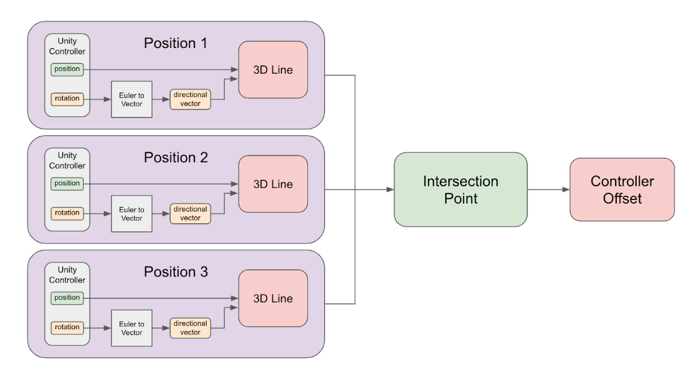
<figcaption>Finding intersection between lines</figcaption>
</figure>

Unfortunately, this approach has a fatal flaw. The aforementioned
procedure has an inherent assumption that the controller attachment is
pointing in the same direction as the controller’s internal direction.
If the attachment was pointing to the left of the controller’s face, for
example, the lines would never all intersect and the least squares
approximation would not return the correct point (Figure <a
href="#fig:old_calibration_diagram3" data-reference-type="ref"
data-reference="fig:old_calibration_diagram3">12</a>).

<figure id="fig:old_calibration_diagram3">
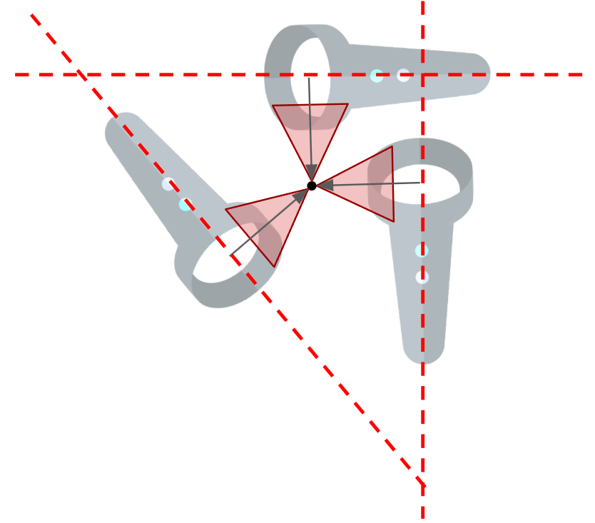
<figcaption>If the pointer attachment pointed left, the lines would
never intersect</figcaption>
</figure>

Instead, we can do a similar procedure, where we still keep the
pointer end static and then rotate the controller about the pointer end.
We can then record four different sets of coordinates as the controller
moves around. Note that because the length of the pointer is constant,
and the location of the endpoint is also constant, the four coordinates
we have collected will define the surface of a sphere. If the
coordinates were all exactly on the surface of the sphere, it is then
trivial to find the centre of the sphere, and thus the coordinates of
the pointer end, but this is not the case. Instead, we have to optimize
the 3 parameters, which correspond with the Cartesian coordinates of the
pointer end, such that the variance in distance between each recorded
set of coordinates and the 3 parameters, is as low as possible. Thus we
have our cost function:

\[\text{Cost} =
\frac{1}{4}\sum^{4}_{i=1}(r_i - \bar{r})^2\]

where \(r_i\) represents the
distance between the \(i\)th recorded
coordinates and the proposed centre and \(\bar{r}\) represents the mean distance
between all of the recorded coordinates and the proposed centre. 
Software aside there exist further considerations about the controller
attachments. Taking off and putting back on the attachment may end up
with slightly different positioning, so ideally we keep the attachments
permanently on the controllers. Luckily for us, we have two controllers
and two separate attachments. Another further consideration is the
attachment mechanism to the actual medical needle. We have decided to
delay designing for the needle until the underlying engineering work is
done. 
Lastly, there is one final consideration in the medical context. In an
operation, the common rule of thumb is that everything below the
doctor’s neck must be sterilized. This means while we do not have to
worry about the sterilization of the headset, we must sterilize the
controllers. The easiest solution is to place the controllers inside
sterilized plastic bags, which are custom-made for sterilizing
non-medical tools. There is a concern that the plastic bag will
interfere with the IR tracking beacons on the controller, but like the
needle attachment design, we will delay this decision.

<h3 id="spa:Spatial Anchors">Spatial Anchors</h3>

To translate the real world into the AR space, physical objects on
the patient’s body (metal fiducial markers) are registered as spatial
anchors. 
Spatial anchors are digital markers that allow AR environments to
accurately anchor virtual objects to specific locations in the real
world. This ensures that virtual content appears stable and remains in
the correct real-world position, even as the user moves and interacts
with the environment. 
 
<strong>SDKs</strong> 
 
To build spatial anchors within Unity for the Meta Oculus Quest 3
headset, several SDKs and integration packages were used. Specifically,
the Meta Oculus Integration package (deprecated) as well as the Meta
All-In-One SDK provided extensive support for the creation,
customization and data extraction for spatial anchors. Using these two
packages, two sets of preliminary spatial anchor prototypes were
created. 

<figure id="fig:meta-all">

<figcaption>Meta All-In-One SDK</figcaption>
</figure>

 
<strong>Prototype 1: Oculus Integration (deprecated)</strong> 
 
The Oculus Integration package (release: 07/2017) provides several
Oculus Unity SDK integrations as a single Unity asset, as well as an
extensive range of existing examples, tutorials and documentation. This
abundance of resources made it a straightforward process to develop the
first prototype. 
 
This prototype, derived from Meta’s Unity StarterSamples, incorporates
XR features such as controller tracking, 3D location markers, anchor
placement, and various tools for interacting with anchors—specifically,
selecting, moving, and deleting them. 
 
This model features a user menu with two options: "Create Anchor" and
"Select Anchor." In the "Create Anchor" mode, the user sees the
controller, which displays location tracking lines to guide placement of
the anchor in 3D space. Users can then place the anchor, represented by
a small anchor icon—a custom prefab specified within Unity—at the chosen
location. Once placed, the anchor remains fixed in that position,
allowing users to observe that it does not move as they interact with
and move around their environment. In the "Select Anchor" mode, users
can select previously placed anchors, move them, or delete them as
needed. 
 
Despite these capabilities, the prototype primarily depended on APIs and
packages that Meta has recently deprecated. This raised concerns about
the prototype’s scalability and long-term maintainability, which are
critical considerations given that the project is expected to span
several years. Since precise and reliable spatial anchoring is essential
for accurately displaying AR overlays, the continued use of this
deprecated integration poses significant risks to the project’s future
effectiveness and support. Therefore, evaluating alternatives or updates
becomes a priority to ensure the longevity and robustness of the system
in handling AR elements within a medical setting.

<figure id="fig:spatial_anc">
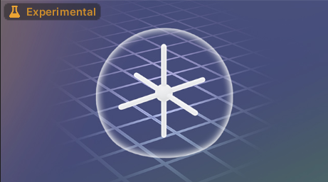
<figcaption>Spatial anchors in AR</figcaption>
</figure>
<h3 id="mesh:3D Meshing with Marching Cubes">3D Meshing with Marching
Cubes</h3>

An important part of our proposed user experience is the use of a 3D
model in our game engine for the user to see the bone structure in real
time. There are many online applications that can take CT scans and turn
them into surface meshes. However, we cannot use them as we would like
all data to stay on the device. Moreover, we want to ensure that we can
render our surfaces as soon as the CT scan is conducted (i.e. at
runtime). As a result, we have implemented an algorithm for meshing
called “Marching Cubes” ((Wikipedia 2023)), that runs in
parallel on the Graphics Processing Unit (GPU) on the headset. Below, we
will walk through our implementation, describe the algorithm and define
some necessary to understand terms.

<h4 id="dsurface-meshes">3D/Surface Meshes:</h4>

Unity renders 3D objects using a <strong>polygon
mesh</strong> (Figure <a href="#fig:3d_reps"
data-reference-type="ref" data-reference="fig:3d_reps">15</a>(iii)). A
polygon mesh is a list of triangles situated in 3D space that reflect
light (based on the texture of their assigned material). A smooth 3D
object is created by placing triangles along the surface of the object
to form a 3D shape.

<h4 id="voxels-and-point-clouds">Voxels and Point Clouds:</h4>

Recall that the CT scan returns a stack of CT images. These can be
layered on top of each other into a 3-dimensional tensor, where each
element is a number between 0 and 1 (where the 1s are the brightest
values representing the most dense structures in the anatomy). This 3D
tensor can be envisioned in two ways:

<ol>
<li>
Voxels: each element in the tensor represents a cube in 3D
space.
</li>
<li>
Point Cloud: each element in the tensor represents the corner of
a cube in 3D space.
</li>
</ol>

These are illustrated in Figure <a href="#fig:3d_reps"
data-reference-type="ref" data-reference="fig:3d_reps">15</a>.

<figure id="fig:3d_reps">
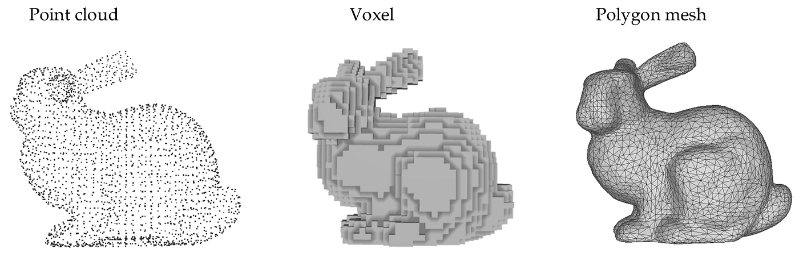
<figcaption>Different methods of representing 3D objects created by CT
scans. <strong>(i)</strong>: Point Cloud Representation.
<strong>(ii)</strong>: Voxel Representation. <strong>(iii)</strong>:
Surface Mesh. ((Gao et al. 2022))</figcaption>
</figure>
<h4 id="marching-cubes">Marching Cubes:</h4>

To take our voxels and turn them into a surface mesh we implement an
algorithm called <strong>marching cubes</strong> ((Wikipedia
2023)):

<ol>
<li>
The stack of CT slices are converted to a <strong>point
cloud</strong> representation.
</li>
<li>
A threshold value is set from which to cull elements of the
tensor. If the value is less than the threshold, the element is set to
0.0, otherwise it is set to 1.0. The point cloud is now a binary
representation of the tensor. The threshold value is selected such that
only points remaining represent bones.
</li>
<li>
The algorithm selects <strong>eight</strong> adjacent elements of
the tensor. These form a “cube” in 3D space, where each point is a
corner of the cube. There are 256 possible cubes; however, by exploiting
their symmetry they can be reduced to 15 different unique
cubes.
</li>
<li>
The cube is compared against a dictionary (Figure <a
href="#fig:marching_cubes" data-reference-type="ref"
data-reference="fig:marching_cubes">16</a>) of the 15 cubes, which
returns a predetermined set of polygons that best describe the surface
created by those points ((Wikipedia 2023)).
</li>
<li>
This is repeated for every <strong>cube</strong> in the tensor as
the algorithm <strong>marches</strong> along all the elements in the
tensor.
</li>
</ol>
<figure id="fig:marching_cubes">
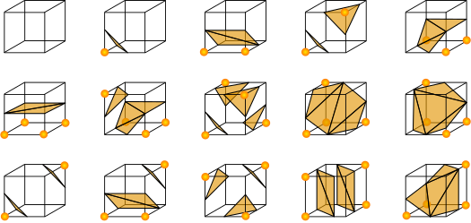
<figcaption>The dictionary that maps the fifteen unique cubes to their
corresponding surface meshes ((Wikipedia 2023)).</figcaption>
</figure>
<h4 id="shaders">Shaders:</h4>

To speed up rendering, game and graphics engines use “shaders”. These
provide an interface for the engines to run rendering processes in
parallel on a Graphics Processing Unit (GPU). Unity provides an API
called “Compute Shaders" which allows the user to define a function,
that is not necessarily used for rendering, to run in parallel on the
GPU, and pass information to and from the CPU by buffers. 
Our implementation of the Marching Cubes algorithm works as described
above. We choose our culling threshold so only bones are rendered
(usually \(\approx 0.85\)).
Additionally, we run the algorithm on the GPU in parallel with shaders
(inspired by (Lague
2019)) – where the mesh for each cube is calculated concurrently
by each GPU thread. Code for this is included in Appendix <a
href="#sec:MarchingCubes" data-reference-type="ref"
data-reference="sec:MarchingCubes">[sec:MarchingCubes]</a> and the
associated GitHub repository.

<h3 id="coord:Coordinate Transform using Horn&#39;s Method">Coordinate
Transform using Horn’s Method</h3>

To project the patient’s anatomy onto their body, we must apply a
coordinate transform to the rendered volume of the spine obtained from
the marching cubes algorithm. 
The first step is to find the Cartesian coordinates of the fiducial
markers in the CT scans. We denote this set of points by the vector
\(x_c\) (CT Fiducials). 
Since the fiducial markers are made of metal and are lying on top of the
patient, they will appear as bright dots on the outer surface of the CT
scan (as shown in Figure <a href="#fig:mannequin"
data-reference-type="ref" data-reference="fig:mannequin">17</a>). While
scrolling through the CT slices, the physician can click on these bright
dots by aiming the controller at them one at a time. This will register
their Cartesian coordinates in the CT frame of reference. 

<figure id="fig:mannequin">
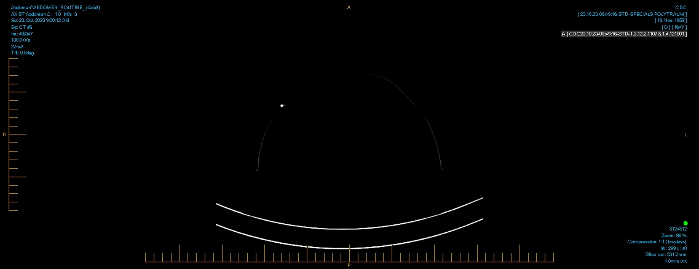
<figcaption>A 2D CT slice of a hollow mannequin with a metal fiducial
marker on its surface.</figcaption>
</figure>

To obtain the coordinates of the physical fiducial markers on the
patient’s body the physician can register them as spatial anchors as
outlined in Section <a href="#spa:Spatial Anchors"
data-reference-type="ref"
data-reference="spa:Spatial Anchors">2.2.3</a>. We denote this set of
points by the vector \(x_p\) (Physical
Fiducials). 
With these two sets of coordinates, we can apply Horn’s Algorithm. This
mapping algorithm was recommended to us Dr. Robert Rohling, an expert in
medical information systems at UBC. It is used to estimate "the
translational (<strong>t</strong>), rotational (<strong>R</strong>), and
uniform scalar (<strong>s</strong>) correspondence between two different
Cartesian coordinate systems given a set of corresponding point pairs"
(Robotics (Knowledgebase 2020)). In our
case, the point pairs are the registered points in \(x_p\) and \(x_c\).

\[x_p = sRx_c + t\]

The goal of Horn’s algorithm is to minimize the error (\(e_i\)) between corresponding fiducials when
the transformation is applied to the CT fiducials (\(x_c\)). 
We applied the following steps to find the best possible transformation
between both coordinate frames.

<h4 id="steps">Steps:</h4>
<ol>
<li>
Find the centroid of each coordinate system where each fiducial
has equal weighting. \[\begin{aligned}        \overline{x}  =
\frac{1}{N} \sum_i x_i     \end{aligned}\]
</li>
<li>
Create new coordinate systems \(x^{\prime}\) that are shifted by the
centroids. \[\begin{aligned}        x^{\prime}_i = x_i -
\overline{x}_i     \end{aligned}\]
</li>
<li>
Find the scale, by the ratio of the norm squared of each shifted
coordinate system. \[\begin{aligned}        s
= \sqrt{\left( \sum_{i} \vert x^{\prime}_{p,i} \vert ^{2}  \right)
\bigg/ \left( \sum_{i} \vert x^{\prime}_{c,i} \vert
^{2}  \right)}     \end{aligned}\]
</li>
<li>
Finally we find the rotation matrix, by minimizing the resulting
error function - \(F(\theta ,\phi,
\psi)\). \[\begin{aligned}        R =
\text{argmin} \,2 \left( \sqrt{\left( \sum_{i} \vert x^{\prime}_{p,i}
\vert ^{2}  \right) \left( \sum_{i} \vert x^{\prime}_{c,i} \vert
^{2}  \right)}  - \sum_{i}  x^{\prime}_{p,i} \cdot \left( R
x^{\prime}_{c,i} \right) \right)     \end{aligned}\]
</li>
<li>
After which the translation (\(t\)) vector can be found: \[\begin{aligned}        t = \bar{x_p} - s R
\bar{x}_c    \end{aligned}\]
</li>
</ol>

To find the rotation matrix <strong>R</strong>, we must perform an
optimization function that minimizes the error between the Physical
Fiducials and the transformed CT Fiducials. This is simple to do in
Python; we can leverage the programming language’s libraries such as
SciPy.optimize.minimize. However, since Horn’s Algorithm must be
performed in real-time in the headset, it must be coded in C#, with the
.NET standard library.

The .NET standard library does not provide a package for scientific
analysis. While there are .NET packages that do provide ways of
optimizing functions, they have proven hard to include in our Unity
projects because many do not target Android. Accordingly, we implemented
our own optimizer \(Q\{E(\theta, \phi, \psi)\}
\to (\theta, \phi, \psi)\). Our algorithm uses a
<strong>prune and search</strong> method to iteratively
select candidate spaces. This drastically reduces the time complexity in
searching for the minimizing rotation matrix. From a search space of
about \(\mathcal{O}(10^9)\) to about
\(\mathcal{O}(10^5)\). A software
diagram of our algorithm is included in Figure <a href="#fig:optimizer"
data-reference-type="ref" data-reference="fig:optimizer">18</a> and a
detailed description attached in Appendix <a href="#sec:Optimizer"
data-reference-type="ref"
data-reference="sec:Optimizer">[sec:Optimizer]</a>.

<figure id="fig:optimizer">
<embed src="./figs/optimizer.pdf" style="width:90.0%" />
<figcaption>Flowchart of rotation optimizer.</figcaption>
</figure>
<h2 id="tests-and-results">Tests and Results</h2>

Our main goal was to design and build an augmented reality system
that has high precision and accuracy while maintaining ease of use for
the user. We aimed to minimize the error between the intended needle
trajectory and the actual needle trajectory. Since our system comprises
numerous registrations and transformations, each with some associated
error, we aimed to minimize the error of each of these components as
much as possible so that the resultant propagated error was also
minimized. Throughout the design of our system, we tried to quantify the
error associated with our various registrations and transformations and
quantify how these errors would affect the final system.

<h3 id="proposed-controller-attachment-tests">Proposed Controller
Attachment Tests</h3>

The crucial thing to test with respect to the controller attachment
is the accuracy of the calibration offset. To test the repeatability of
the calibration procedure, we can perform the calibration multiple times
and examine the variance of our results. 
To test the accuracy of the calibration offset, we will add a marker to
a piece of paper on a flat surface. A user will then put on the headset
and draw a dot on the paper where they see the offset point in AR. By
measuring the distance between the drawn dot and the marker, we get a
measure of the accuracy of the calibration offset (Figure <a
href="#fig:controller_pointer_testing" data-reference-type="ref"
data-reference="fig:controller_pointer_testing">19</a>).

<figure id="fig:controller_pointer_testing">
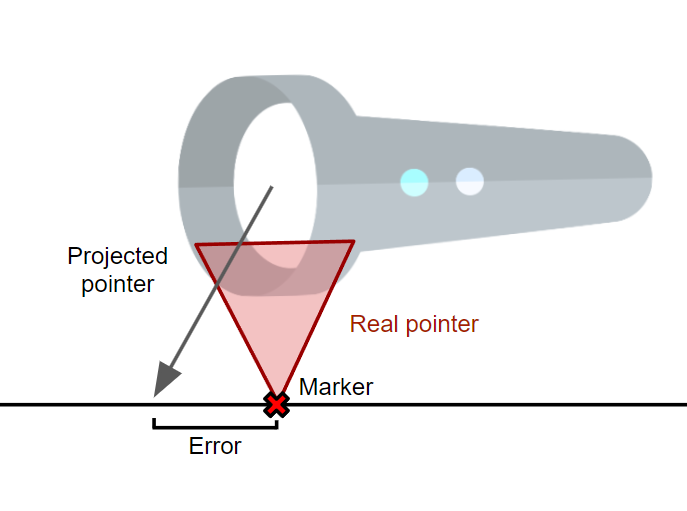
<figcaption>Testing controller calibration offset accuracy</figcaption>
</figure>
<h3 id="horns-algorithm-error-propagation">Horn’s Algorithm Error
Propagation</h3>

To test how errors propagate we used a series of Monte Carlo
simulations rather than finding an analytic solution. By altering
different parameters of the simulation we found how they affect the
error propagation in the system. A full Jupyter notebook can be found in
Appendix 1.

<h4 id="methodology">Methodology</h4>

The steps we took to conduct the simulations were as follows:

<ol>
<li>
Generate \(N\) fiducicials. Each
of these is situated in the XY plane, at some radius \(R\) away from the origin. They are evenly
spaced around the origin \(\frac{2
\pi}{N}\) radians apart from each other.
</li>
<li>
Each fiducial is randomly (normal distribution \(\Delta \sim \text{Norm}(0, R / 5)\)
perturbed in the X, Y and Z directions by some value. This step and the
previous step simulate the curves and non uniform shape of the back of a
patient. These points define the “Registered Fiducials” (\(x_l\))
</li>
<li>
A random transform is created, with scale (s), euler rotation (R)
and translation (t). Then the same transform is applied to each of the
fiducials.
</li>
<li>
Each of the fiducials is perturbed once again by some small
amount in \(X_e\), \(Y_e\) and \(Z_e\) (each of them normally distributed:
\(\Delta_e \sim N(r, \sigma_e)\). We
define a new random variable : \[E_T =
\sum_i^N \sqrt{X_{ei}^2 + Y_{ei}^2 + Z_{ei}^2}\] Where \(i\) denotes the \(i\)th fiducial. This step simulates some
random mean squared error (RMSE) that is added during the registration
process. This new set of fiducials defines the “CT Fiducials” \(x_r\).
</li>
<li>
We run Horns Algorithm to map the CT Fidcucials to the Registered
Fiducials (\(\textbf{H} x_r \to x_{rt} \approx
x_l\)).
</li>
<li>
We find the RMSE error between the Transformed CT Fiducials and
the Registered Fiducials: \[E_R = \sum_i^N
\sqrt{(X_{rt} - X_l)^2 + (Y_{rt} - Y_l)^2 + (Y_{rt} -
Y_l)^2}\]
</li>
<li>
To find how the errors propagate we compared the standard
deviations and means of \(E_T\) and
\(E_R\) (assuming they are normal
distribution by law of large numbers): \[\begin{aligned}        &amp;E_T \sim
\text{Norm}(\bar{T}, \sigma_T) \\        &amp;E_R \sim
\text{Norm}(\bar{R}, \sigma_R)    \end{aligned}\] An example
result of the simulation can be seen in Figure <a
href="#fig:normal-dist" data-reference-type="ref"
data-reference="fig:normal-dist">20</a>

<figure id="fig:normal-dist">
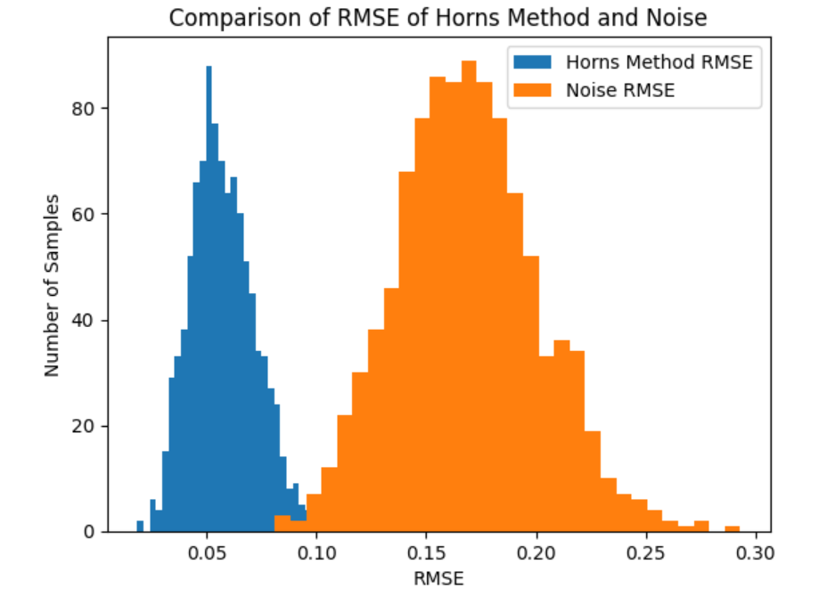
<figcaption>An example output from the simulation, comparing the input
error and the error after Horn’s Algorithm has been used to transform
the noisy data.</figcaption>
</figure></li>
</ol>
<h4 id="results">Results</h4>

The results can be split into two parts:

<ol>
<li>
Error changes with respect to fiducial distance from orgin (\(r\)): \[\begin{aligned}    f_X(r) &amp;= \frac{\text{X of
} E_T (r)}{\text{X of } E_R (r)} \\    \log|f_{\text{Mean}}(r)|
&amp;=  -0.438 \cdot r - 2.02 \quad
\text{(Figure~\ref{fig:mean_error})}\\    \log|f_{\text{STD}}(r)| &amp;=
-0.431 \cdot r - 3.2 \quad
\text{(Figure~\ref{fig:std_error})}    \end{aligned}\] This is an
exponential decay. Where initial increases in the distance from the
origin decrease the errors in the registration greatly. However, this
effect drops off as the distance becomes large.

<figure id="fig:error_propagation">
<figure id="fig:std_error">
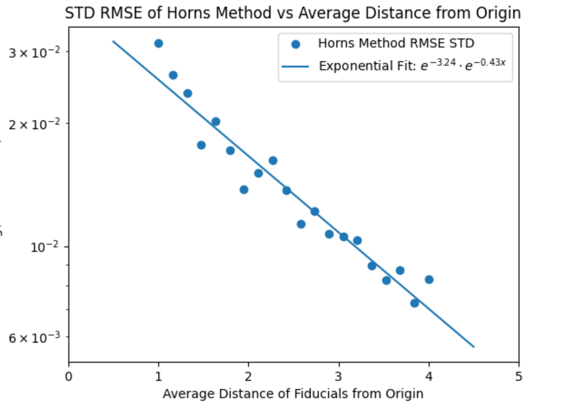
<figcaption>Shows how the standard deviation of errors changes as \(r\) increases.</figcaption>
</figure>
<figure id="fig:mean_error">
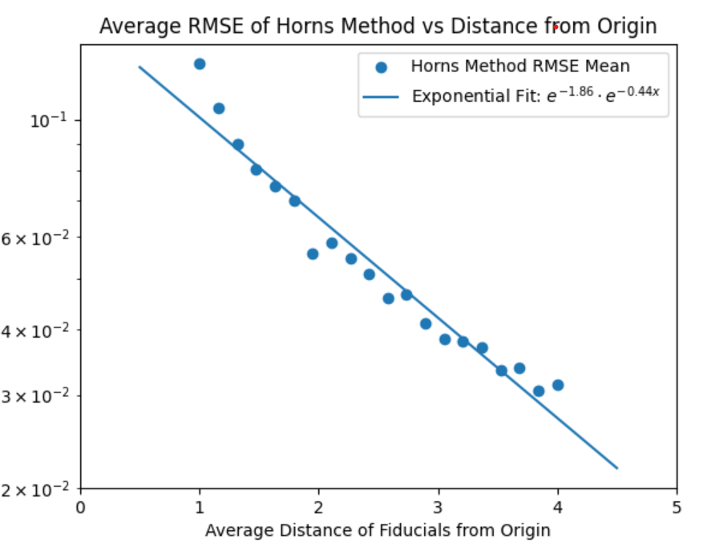
<figcaption>Shows how the mean of errors changes as \(r\) increases.</figcaption>
</figure>
<figcaption>The results of how the errors propagate from horns
algorithm. Note these are logy graphs.</figcaption>
</figure></li>
<li>
Error changes with respect to the number of fiducials (N) - our
results are only qualitative. However, the mean change in error
increases with the N, while the STD (precision) decreases with N
(Figure <a href="#fig:N_horns" data-reference-type="ref"
data-reference="fig:N_horns">26</a>).

<figure id="fig:N_horns">
<figure id="fig:N_mean">
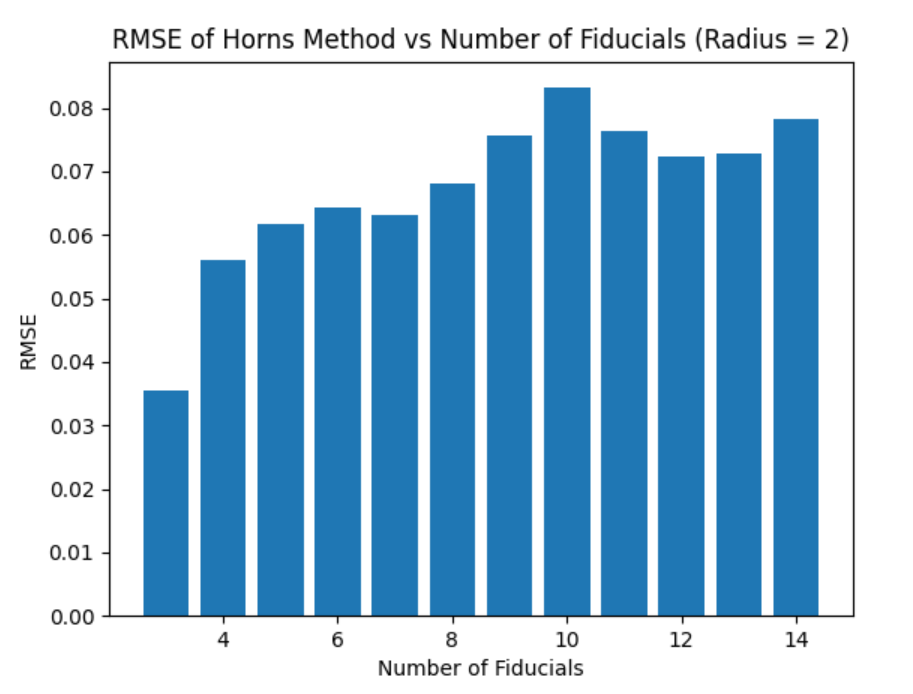
<figcaption>Shows how the mean of errors changes as \(N\) increases.</figcaption>
</figure>
<figure id="fig:N_std">
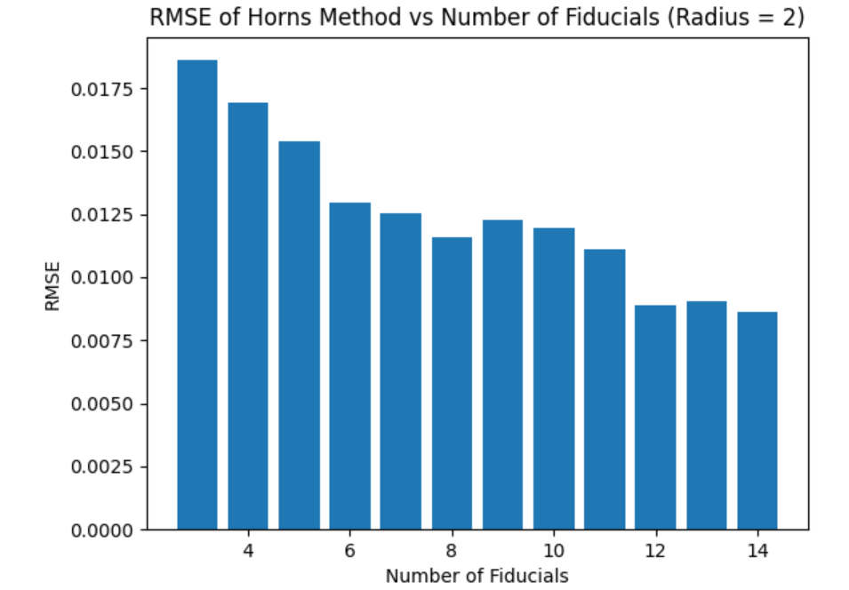
<figcaption>Shows how the <strong>standard deviation</strong> of errors
changes as \(N\)
increases.</figcaption>
</figure>
<figcaption>The results of how the errors propagate from horns
algorithm. Note these are logy graphs.</figcaption>
</figure></li>
</ol>
<h4 id="key-takeaways-and-limitations.">Key Takeaways and
Limitations.</h4>

This analysis suggests that we should have a large distance between
the fiducials and keep the number of fiducials between three and five.
However, this analysis only shows the average error between coordinate
systems and does not show localised errors. It will be important to
investigate localised errors further as they are more relevant to our
application. 
So far, we have only used Horn’s algorithm on simulations using sets of
generated sample points with random error. We are assuming that the real
system will behave similarly to this simulation, but this may be a false
assumption. This limits the conclusions we can make from these
simulations. We will need to apply this algorithm to the actual
coordinates of fiducial markers registered using our spatial anchoring
procedure and see if we obtain acceptable results.

<h1 id="conclusions">Conclusions</h1>
<h2 id="controller-attachments">Controller Attachments</h2>

We have 3D printed controller attachment prototypes and qualitatively
tested the rigidity of their connection to the Quest 3 controllers
(Figure <a href="#fig:controller_pointer_picture"
data-reference-type="ref"
data-reference="fig:controller_pointer_picture">27</a>). In addition, we
have developed a software implementation of the proper calibration
procedure up until the optimization function.

<figure id="fig:controller_pointer_picture">

<figcaption>Controller pointer attachment prototype</figcaption>
</figure>
<h2 id="spatial-anchors">Spatial Anchors</h2>

We have created a Unity demo to allow the user to place and remove
spatial anchors at an arbitrary location with respect to the
controller.

<h2 id="horns-algorithm">Horn’s Algorithm</h2>

We have finished writing an implementation of the Horn’s algorithm in
a Jupyter notebook and C# script. The aforementioned error propagation
simulations for Horn’s algorithm has given us insight into the effects
of uncertainty on the mapping.

<h2 id="d-meshing">3D Meshing</h2>

We have fully implemented volumetric 3D rendering in Unity (Figure <a
href="#fig:volumetric_rendering" data-reference-type="ref"
data-reference="fig:volumetric_rendering">28</a>). The rendering is
interactable and transformable, allowing for us to define its location
with spatial anchors in the future.

<figure id="fig:volumetric_rendering">
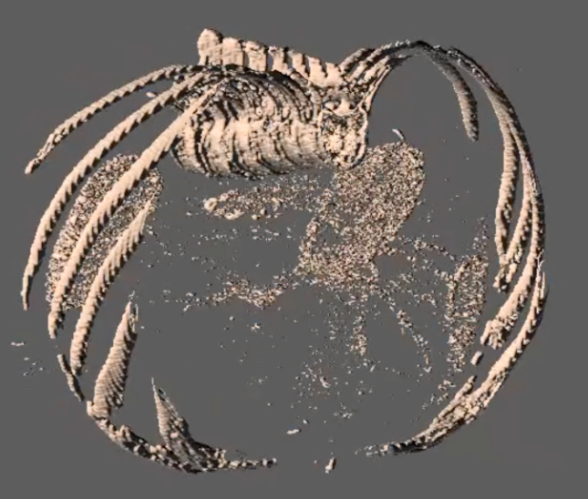
<figcaption>Volumetric rendering of CT scans rendered in
Unity</figcaption>
</figure>
<h1 id="recommendations">Recommendations</h1>

This is a two year project and we plan to implement all the features
outlined in our Proposed Solution (Section <a
href="#sec:ProposedSolution" data-reference-type="ref"
data-reference="sec:ProposedSolution">1.7</a>). While we have some of
the missing features are written out in either Python or C# we still
need to integrate them. The progress of incomplete sub-systems is
written out below:

<ol>
<li>
Registration with Horn’s Algorithm – Horns algorithm written out
in C# but not integrated with a Unity game world (“scene"). Registration
with spatial anchors is complete but not integrated with our
demo.
</li>
<li>
Slice Selection – Selection is implemented and integrated with
our demo. However, we are missing the ability to situate the slices in
the scene (see above) and draw a desired directory on the
slices.
</li>
<li>
Controller Registration – Mathematical theory has been worked out
but not implemented in code.
</li>
<li>
Controller Tracking and Angle Feedback – Not implemented on any
platform.
</li>
<li>
Runtime downloading of DICOM files from hospital servers, and
conversion and extraction of CT Slices – Not implemented on any
platform.
</li>
</ol>

Additionally, we need to evaluate the effectiveness of AR as a means
of guidance in clinical settings. This includes evaluating the:

<ol>
<li>
Tracking accuracy of the Meta Quest 3 controllers.
</li>
<li>
Consistency of Quest 3 headset in situating itself over long
periods of time.
</li>
<li>
User accuracy using our technique. We recommend doing this by
conducting tests where the headset user is asked to insert a needle into
a foam block using only the visual guidance of the headset. The
insertion and end points of the needle through the foam block would then
be compared with the intended trajectory to evaluate the accuracy of the
system.
</li>
<li>
Effectiveness of the different sub-systems our technique uses in
assisting the user (e.g. does the 3D model provide better assistance to
the user than hand tracking).
</li>
<li>
User experience of our systems based on feedback from
clinicians.
</li>
</ol>
<h1 id="deliverables">Deliverables</h1>
<h2 id="mechanical">Mechanical</h2>

CAD models for the controller attachments and testing rigs can be
found in an <a
href="https://cad.onshape.com/documents/a7669772db1e8cf42f0d84d7/w/a372f52852661928ae6b39d4/e/6cbc84bf2eabff7db7f6d995?renderMode=0&amp;uiState=661c9dc0dc1f8708bbbcbccf">Onshape
document.</a>

<h2 id="software">Software</h2>

A majority of our work is contained in <a
href="https://github.com/okim1227/AR-Spinal-Injection.git"><u>a GitHub
Repository</u></a> including working Unity scenes, Jupyter (Python)
Notebooks and C# scripts.

<ol>
<li>
“<strong>ProjectFair/</strong>” is a Unity scene which
implements:

<ol>
<li>
Slice Selection,
</li>
<li>
3D Modelling with Marching Cubes.
</li>
</ol></li>
<li>
“<strong>Notebooks/Horns.ipynb</strong>” – Python Jupyter
Notebook showing how we implement Horn’s Algorithm and it’s error
propagation (.html file included as well).
</li>
<li>
“<strong>Scripts/Horns.cs</strong>” – Unity C# file that uses
Horns Algorithm and implements our rotation function optimiser.
</li>
</ol>
<h1 class="unnumbered" id="references">References</h1>

Clinic, Mayo. 2022. “X-Ray.” <em>Mayo Clinic</em>, January.
<a
href="https://www.mayoclinic.org/tests-procedures/ct-scan/about/pac-20393675">https://www.mayoclinic.org/tests-procedures/ct-scan/about/pac-20393675</a>.

Gao, Mengran, Ningjun Ruan, Junpeng Shi, and Wanli Zhou. 2022.
“Deep Neural Network for 3D Shape Classification Based on Mesh
Feature.” <em>Sensors</em> 22 (18). <a
href="https://doi.org/10.3390/s22187040">https://doi.org/10.3390/s22187040</a>.

Gillis, Alexander S. 2024. “What Is Augmented Reality
(AR)?” <em>TechTarget</em>. <a
href="https://www.techtarget.com/whatis/definition/augmented-reality-AR">https://www.techtarget.com/whatis/definition/augmented-reality-AR</a>.

Heinrich, Florian, Lovis Schwenderling, Mathias Becker, Martin Skalej,
and Christian Hansen. 2019. “HoloInjection: Augmented Reality
Support for CT-Guided Spinal Needle Injections.” <em>Healthcare
Technology Letters</em> 6 (November). <a
href="https://doi.org/10.1049/htl.2019.0062">https://doi.org/10.1049/htl.2019.0062</a>.

Knowledgebase, Robotics. 2020. “Registration Techniques in
Robotics.” 2020. <a
href="https://roboticsknowledgebase.com/wiki/math/registration-techniques/">https://roboticsknowledgebase.com/wiki/math/registration-techniques/</a>.

Lague, Sebastion. 2019. “Marching Cubes.” 2019. <a
href="https://github.com/SebLague/Marching-Cubes.git">https://github.com/SebLague/Marching-Cubes.git</a>.

Medicine, John Hopkins. 2023. “Computed Tomography (CT)
Scan.” <em>Www.hopkinsmedicine.org</em>. <a
href="https://www.hopkinsmedicine.org/health/treatment-tests-and-therapies/computed-tomography-ct-scan">https://www.hopkinsmedicine.org/health/treatment-tests-and-therapies/computed-tomography-ct-scan</a>.

Wikipedia, The Free Encyclopedia. 2023. “Marching Cubes
Algorithm.” Wikipedia, The Free Encyclopedia. 2023. <a
href="https://en.wikipedia.org/wiki/Marching_cubes">https://en.wikipedia.org/wiki/Marching_cubes</a>.

</body>