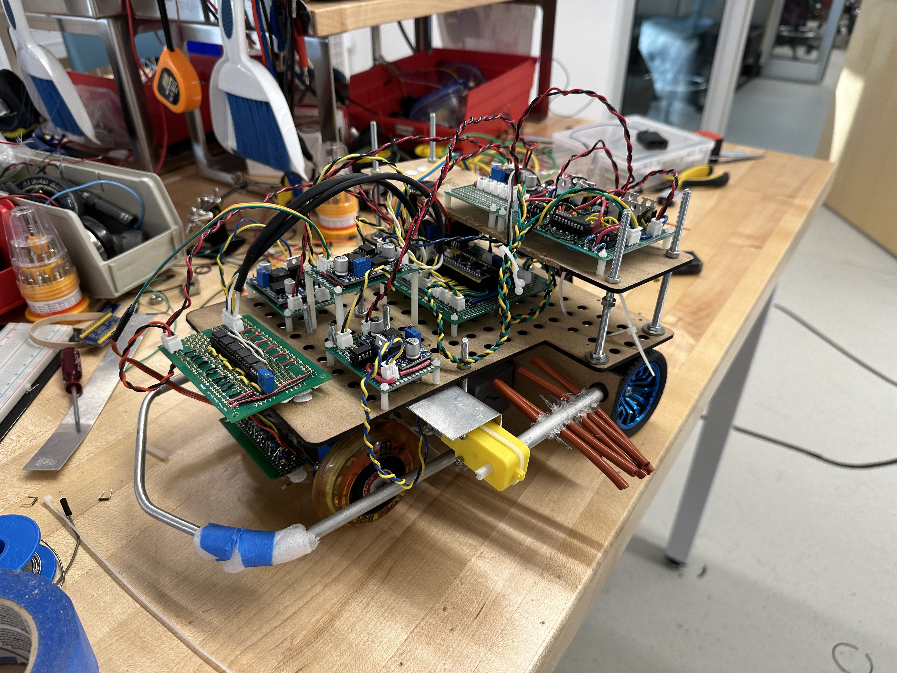

Participating in a robot line following competition is an exhilarating journey that combines technical prowess with strategic thinking. The challenge involves designing and building a robot capable of autonomously navigating a black line on a white surface, often at high speeds. 

**Key aspects of the competition:**

* **Design and Construction:** Participants must engineer a robot that is lightweight, maneuverable, and equipped with sensors to detect the line.
* **Programming:** The robot's behavior is determined by complex algorithms that enable it to follow the line accurately and efficiently.
* **Strategy:** Competitors often employ various strategies to optimize their robot's performance, such as adjusting speed, turning radius, and sensor sensitivity.
* **Competition:** The robots race against each other on a predetermined course, with the fastest and most accurate robot emerging as the winner.

**Benefits of participating:**

* **Hands-on experience:** Gain practical skills in robotics, electronics, and programming.
* **Problem-solving:** Develop critical thinking and problem-solving abilities.
* **Teamwork:** Collaborate with others to achieve a common goal.
* **Passion:** Discover a lifelong interest in technology and engineering.

**Whether you're a seasoned robotics enthusiast or a beginner looking for a new challenge, competing in a robot line following competition is a rewarding and unforgettable experience.**