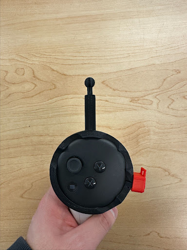

## The Problem
The goal of this project was to use the Meta Quest 3 AR headset to assist radiologist performing [spinal injections](https://my.clevelandclinic.org/health/treatments/22091-lumbar-epidural-steroid-injection) at UBC Hospital. To achieve this we devised a method for registering a patient using the Quest 3 controller and metal fiducials to overlay the CT image data over the patient and project a trajectory for the physician in the AR world from the headset. 

Here I try to summarise some of the key algorithms we used for registration. 

## Sections
- [Horns Method](#horns-method-for-point-cloud-registration)
- [Controller Calibration](#controller-calibration)
- [Results](#results)

## Horn's Method For Point Cloud Registration
_Much of the work in this section of the project was based off of [Robotics Knowledge](https://roboticsknowledgebase.com/wiki/math/registration-techniques/)._

In order to find a transformation from the CT Scans ("CT World") to the AR world we used **Horn's Method**. The goal of Horns Method is to find a transform (uniform scale, rotation and translation) that minimises the error between one set of, $N$, fiducials (Left Hand) to another set of corresponding fiducials (Right Hand). More formally: 
$$
    (t, s, R) = \text{{argmin}} \sum |e_i|^2 
$$

$$
    \text{{where, }} e_i = x_{{r, i}} - sRx_{{l, i}} - t
$$

The algorithm is as follows:
1. Find the mean position of the fiducials in each coordinate system. Then shift them such that each mean is at the origin.
$$
x'_{{l, i}} = x_{{l,i}} - \bar{{x}}_l, \quad x'_{{r, i}} = x_{{r,i}} - \bar{{x}}_r
$$
<iframe
  class="w-full aspect-video rounded"
  src="https://www.youtube-nocookie.com/embed/q41dPZmEhJE"
  frameborder="0"
  allow="accelerometer; autoplay; encrypted-media; gyroscope; picture-in-picture"
  allowfullscreen>
</iframe>

2. Find the root mean squared for the distance of each the shifted fiducials from the origin. 
$$
 \sqrt{{\langle (x'_l)^2 \rangle}} = \sqrt{{\frac{{\sum |x_{{l,i}}|^2}}{{N}}}}, \quad \sqrt{{\langle (x'_r)^2 \rangle}} = \sqrt{{\frac{{\sum |x_{{r,i}}|^2}}{{N}}}}
$$

3. The ratio between these rms-values is the, $s$, the scale:
$$
 s = \sqrt{{\langle (x'_r)^2 \rangle / \langle (x'_l)^2 \rangle}}
$$

<iframe
  class="w-full aspect-video rounded"
  src="https://www.youtube-nocookie.com/embed/I1UAXCJH9z0"
  frameborder="0"
  allow="accelerometer; autoplay; encrypted-media; gyroscope; picture-in-picture"
  allowfullscreen>
</iframe>

4. Find the covariance matrix, $H$, of the shifted coordinate frames, then find its $\text{{SVD}}$ decomposition:
$$
 H = (x'_l)^T x'_r = U \Sigma V^T
$$
5. From SVD decomposition we can find the rotation matrix, $R$ (this minimizes the error between the shifted and scaled fiducials):
$$
 R = VU^T
$$
<iframe
  class="w-full aspect-video rounded"
  src="https://www.youtube-nocookie.com/embed/q9zw2KGT0pQ"
  frameborder="0"
  allow="accelerometer; autoplay; encrypted-media; gyroscope; picture-in-picture"
  allowfullscreen>
</iframe>

6. Finally, we find the the translation, $t$, from $s$ and $R$:
$$
 t = \bar{{x}}_r - sR\bar{{x}}_l
$$

With this $s$, $R$, and $t$, we have the transformation necessary to project positions from the left coordinate system to the right coordinate system. 
<iframe
  class="w-full aspect-video rounded"
  src="https://www.youtube-nocookie.com/embed/wLQaznJeass"
  frameborder="0"
  allow="accelerometer; autoplay; encrypted-media; gyroscope; picture-in-picture"
  allowfullscreen>
</iframe>

## Controller Calibration

A 3-D-printed pointer attaches to the Quest 3 controller. The user can use this tip to point at fiducials, clicking the trigger adds the world coordinate of the fiducial to the AR Managaer. However, Unity’s pose data is relative to the controller body—not the tip, and the position is poorly documented.  
To recover that tip offset, we devised a calibration procedure as follows:

1. **Ball-and-socket rig** – the pointer tip is replaced with a ball, which can be placed in a fixed socket.  
2. **Sweep** – we rotate the controller and report it's poses. These positions trace out the surface of a sphere, and the center is the pointer position (as it remains fixed in space).
3. **Fit** – a least-squares sphere fit gives the centre.

Ball Joint | Ball-and-Socket  
:--:|:--:  
 | 

Tracing the Sphere | Least-Squares Fit  
:--:|:--:  
 | 

# Results
Below is a video showing the registration workflow on a silicone spinal phantom.  
* **Red volume** – CT data aligned to the phantom.  
* **Blue cylinder** – the planned needle trajectory for the radiologist.
<iframe
  class="w-full aspect-video rounded"
  src="https://www.youtube-nocookie.com/embed/5wU2Zua6ctA"
  frameborder="0"
  allow="accelerometer; autoplay; encrypted-media; gyroscope; picture-in-picture"
  allowfullscreen>
</iframe>